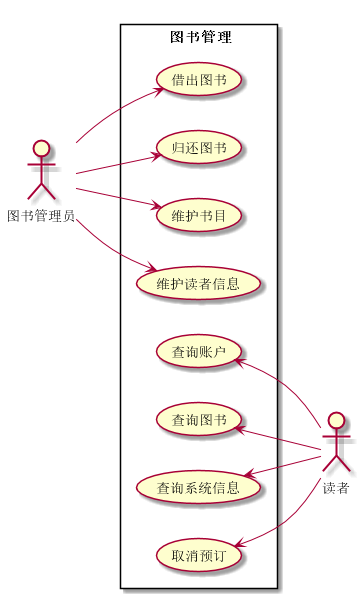

# 实验2：图书管理系统用例建模
|学号|班级|姓名|
|:-------:|:-------------: | :----------:|:---:|
|201510414222|软件(本)15-2|杨龙|
## 1. 图书管理系统的用例关系图

### 1.1 用例图PlantUML源码如下：
```
@startuml
left to right direction
skinparam packageStyle rectangle
actor 读者
actor 图书管理员
rectangle 图书管理 {
   图书管理员-->(借出图书)
   图书管理员-->(归还图书)
    图书管理员-->(维护书目)
    图书管理员-->(维护读者信息)
   (查询账户) <--读者
   (查询图书) <--读者
   (查询系统信息) <--读者
    (取消预订) <--读者 
}

@enduml
```


### 1.2. 用例图如下：

**“借书”用例流程图源码如下：**
```
@startuml
    
    start;
        :登录;
        :查询图书信息;
        :选择目标图书;
        fork
        :点击续借;
        if(是否已续借一次？) then(yes)
            :提示仅能续借一次;
            :续借失败;
        else(no)
            :续借成功;
        endif;
        fork again
        :点击借阅;
        if(是否有库存？) then(yes)
            if(是否超出借阅上限？) then(yes)
                :借书失败;
             else(no)
                :借书成功;
            endif;
        else(no)
            :提示没有库存;
            :借书失败;
        endif;
        endfork;
    :退出;
    stop;
    @enduml```

**“购入图书”用例流程图源码如下：**


