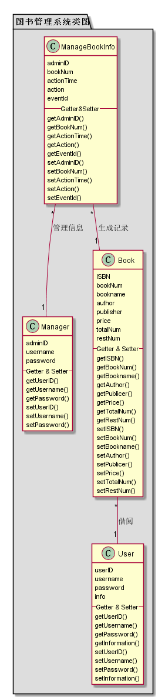
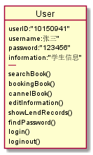
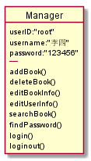
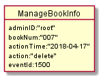
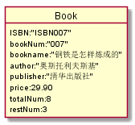

# 实验3：图书管理系统领域对象建模
|学号|班级|姓名|照片|
|:-------:|:-------------: | :----------:|:---:|
|201510414222|软件(本)15-2|杨龙||

## 1. 图书管理系统的类图

### 1.1 类图PlantUML源码如下：

``` class
@startuml test3_1
package "图书管理系统类图" #DDD{
class Manager{
    adminID
    username
    password
    --Getter & Setter--
    getUserID()
    getUsername()
    getPassword()
    setUserID()
    setUsername()
    setPassword()
}

class User{
    userID
    username
    password
    info
    --Getter & Setter--
    getUserID()
    getUsername()
    getPassword()
    getInformation()
    setUserID()
    setUsername()
    setPassword()
    setInformation()
}

class Book{
    ISBN
    bookNum
    bookname
    author
    publisher
    price
    totalNum
    restNum
    --Getter & Setter--
    getISBN()
    getBookNum()
    getBookname()
    getAuthor()
    getPublicer()
    getPrice()
    getTotalNum()
    getRestNum()
    setISBN()
    setBookNum()
    setBookname()
    setAuthor()
    setPublicer()
    setPrice()
    setTotalNum()
    setRestNum()
}
class ManageBookInfo{
    adminID
    bookNum
    actionTime
    action
    eventId
    --Getter&Setter--
    getAdminID()
    getBookNum()
    getActionTime()
    getAction()
    getEventId()
    setAdminID()
    setBookNum()
    setActionTime()
    setAction()
    setEventId()
}

ManageBookInfo "*" -- "1" Manager:管理信息
ManageBookInfo "*" -- "1" Book:生成记录

Book "*" -- "1" User:借阅

}
@enduml
```

### 1.2. 类图如下：



## 2. 图书管理系统的对象图
### 2.1 类user的对象图
#### 源码如下：
``` class
@startuml
@startuml
object User{
    userID:"10150941"
    username:张三"
    password:"123456"
    information:"学生信息"
    ----
    searchBook()
    bookingBook()
    cannelBook()
    editInformation()
    showLendRecords()
    findPassword()
    login()
    loginout()
}
@enduml
``` 
#### 类user对象图如下：


### 2.2 类manager的对象图
#### 源码如下：
``` class
@startUml manager
object Manager{
    userID:"root"
    username:"李四"
    password:"123456"
    ----
    addBook()
    deleteBook()
    editBookInfo()
    editUserInfo()
    searchBook()
    findPassword()
    login()
    loginout()
}
@endUml
``` 
#### 对象图如下：

### 2.3 类ManageBookInfo的对象图
``` class
@startuml
object ManageBookInfo{
    adminID:"root"
    bookNum:"007"
    actionTime:"2018-04-17"
    action:"delete"
    eventId:1500
}
#### 对象图如下：
``
### 2.4 类book的对象图
#### 源码如下：
``` class
@startUml book
object Book{
    ISBN:"ISBN007"
    bookNum:"007"
    bookname:"钢铁是怎样炼成的"
    author:"奥斯托利夫斯基"
    publisher:"清华出版社"
    price:29.90
    totalNum:8
    restNum:3
}
@enduml
``` 
#### 对象图如下：


