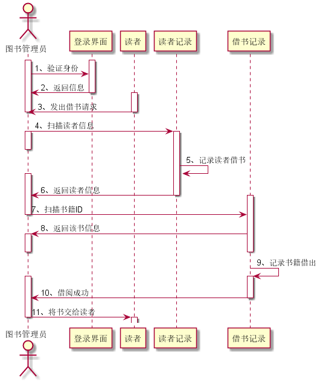

# 实验4：图书管理系统顺序图绘制
|学号|班级|姓名|照片|
|:-------:|:-------------: | :----------:|:---:|
|201510414222|软件(本)15-2|杨龙||


### 1 借书时序图源码如下：

``` class
@startuml
actor 图书管理员
activate 图书管理员
activate 登录界面
图书管理员 -> 登录界面 :1、验证身份
登录界面 -> 图书管理员 :2、返回信息
deactivate 登录界面
activate 读者
读者 -> 图书管理员 :3、发出借书请求
deactivate 读者
deactivate 图书管理员
图书管理员 -> 读者记录 :4、扫描读者信息
activate 图书管理员
deactivate 图书管理员
activate 读者记录
读者记录 -> 读者记录 : 5、记录读者借书
activate 图书管理员
读者记录 -> 图书管理员 :6、返回读者信息
deactivate 读者记录
activate 借书记录
图书管理员 -> 借书记录 :7、扫描书籍ID
deactivate 图书管理员
借书记录 -> 图书管理员 :8、返回该书信息
activate 图书管理员
deactivate 图书管理员
deactivate 借书记录
借书记录 -> 借书记录 :9、记录书籍借出
activate 借书记录
activate 图书管理员
借书记录 -> 图书管理员 : 10、借阅成功
deactivate 借书记录
图书管理员 -> 读者 :11、将书交给读者
deactivate 图书管理员
activate 读者
deactivate 读者
@enduml

```

### 1.1. 时序图如下：



## 2 还书时序图源码如下：

``` 
@startuml
actor 图书管理员
图书管理员 -> 登录界面 :1、验证身份
activate 图书管理员
activate 登录界面
登录界面 -> 图书管理员 :2、返回信息
deactivate 登录界面
读者 -> 图书管理员 :3、还书请求
activate 读者
deactivate 读者
deactivate 图书管理员
图书管理员 -> 读者记录 : 4、扫描读者信息
activate 读者记录
activate 图书管理员
deactivate 图书管理员
读者记录 -> 读者记录:5、记录读者还书
读者记录 -> 图书管理员 :6、返回读者信息
deactivate 读者记录
activate 图书管理员
图书管理员 -> 还书记录 :7、扫描书籍ID
activate 还书记录
deactivate 图书管理员
还书记录 -> 图书管理员 :8、返回该书信息
activate 图书管理员
deactivate 图书管理员
deactivate 还书记录
还书记录 -> 还书记录 :9、记录书籍还回
activate 还书记录
还书记录 -> 图书管理员 : 10、还书成功
deactivate 还书记录
activate 图书管理员
deactivate 图书管理员
@enduml

```
### 2.1. 时序图如下：


