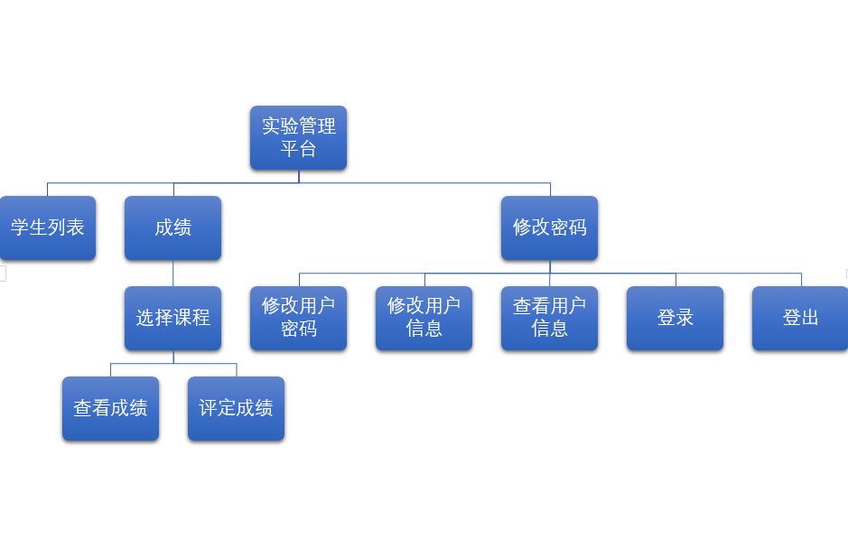
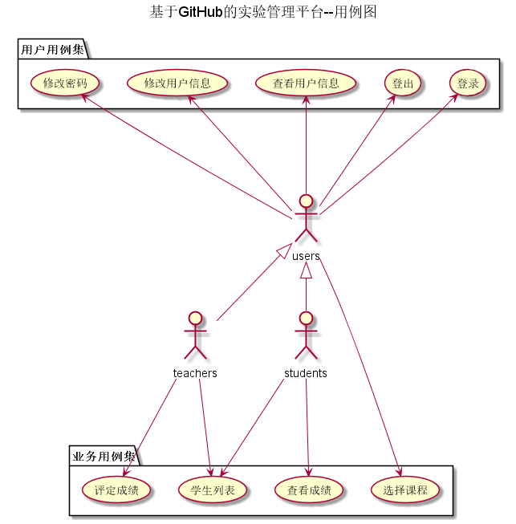

# 基于GitHub的实验管理平台的分析与设计

### 成都大学信息科学与工程学院
|学号|班级|姓名|照片|
 |:-------:|:-------------: | :----------:|:---:|
 |201510414222|软件(本)15-2|杨龙||

## 1. 概述
- 基于GitHub的实验管理平台的作用是在线管理实验成绩的Web应用系统。学生和老师的实验内容均存放在GitHUB
页面上。
- 学生的功能主要有：一是设置自己的GitHub用户名，二是查询自己的实验成绩。学生的GitHub用户名是公开的，但成绩不公开。
- 老师的功能主要有：一是对学生实验的不同方面进行评分，如实验报告，代码逻辑，及代码改进。二是查看每个学生的成绩。
- 老师和学生都能通过本系统的链接方便地跳转到学生的每个GitHUB实验目录，以便批改实验或者查看实验情况。
- 实验成绩按数字分数计算，每项实验的满分为100分，最低为0分。
- 系统自动计算每个学生的所有实验的平均分。
    
## 2. 系统总体结构

    
## 3. 用例图设计 [源码](usecase.md)

## 4. 类图设计 [源码](class.md)

## 5. 数据库设计
- ### [参见数据库设计](数据库实现.md)

## 6. 用例及界面详细设计
- ### [“学生信息”用例及界面](学生信息用例.md)
- ### [“评定成绩”用例及界面](评定成绩用例.md)
- ### [“查看成绩”用例及界面](查看成绩用例.md)
- ### [“修改密码”用例及界面](修改密码用例.md)
- ### [“修改用户信息”用例及界面](修改用户信息用例.md)
- ### [“查看用户信息”用例及界面](查看用户信息用例.md)
- ### [“登出”用例及界面](登出用例.md)
- ### [“登录”用例及界面](登录用例.md)
