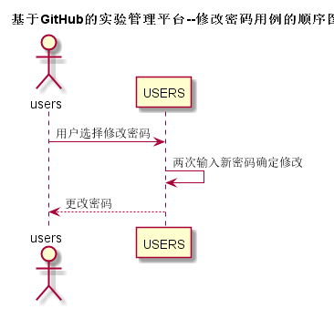
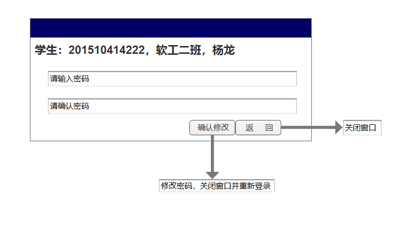

# “修改密码”用例 [返回](README.md)
## 1. 用例规约

|用例名称|修改密码|
|-------|:-------------|
|功能|修改用户的密码|
|参与者|学生，老师|
|前置条件|必须先登录|
|后置条件|修改密码以后必须强制登出，再跳转到登录页面|
|主事件流| 1.用户填写新密码（两次输入）   2.用户提交修改信息  3.系统存储修改后密码|
|备选事件流|1a. 用户两次输入的密码不同  &nbsp;&nbsp; 1.系统提示两次输入的密码不相同   &nbsp;&nbsp; 2. 用户重新填写并提交。 |

## 2. 业务流程

## 3. 界面设计
- 界面预览

- API接口调用
    - 接口1：[setPassword](设置密码api.md)

## 4. 算法描述 
修改密码时确定输入两次相同的密码
    
## 5. 参照表
users
- [USERS](../数据库设计.md/#USERS)
