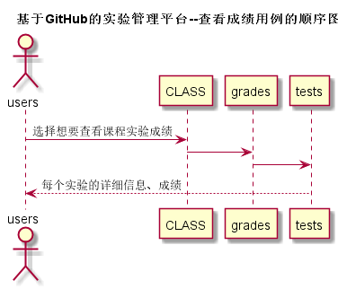
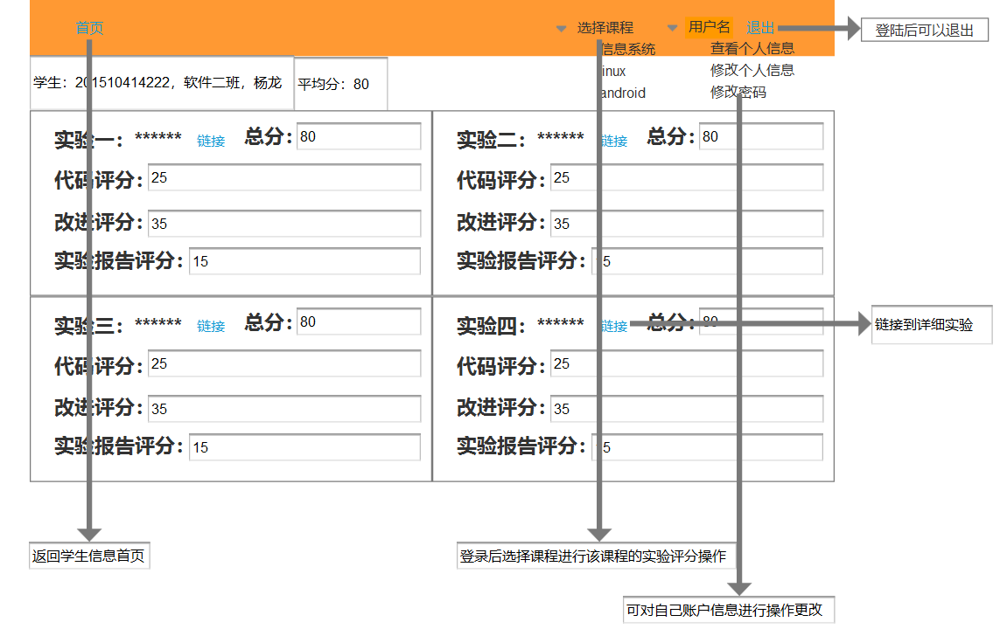

# “查看成绩”用例 [返回](README.md)
## 1. 用例规约

|用例名称|查看成绩|
|-------|:-------------|
|功能|学生查看自己的每个实验的实验成绩及各方面得分|
|参与者|学生|
|前置条件|学生需要先登录|
|后置条件| |
|主事件流| |
|备选事件流| |

## 2. 业务流程（顺序图）

## 3. 界面设计
- 界面预览

- API接口调用
    - 接口1：[getOneStudentResults](显示学生信息api.md) 

## 4. 算法描述
    无
    
## 5. 参照表
- [STUDENTS](数据库实现.md/#STUDENTS)
- [GRADES](数据库实现.md/#GRADES)
- [TESTS](数据库实现.md/#TESTS)
- [CLASS](数据库实现.md/#CLASS)
